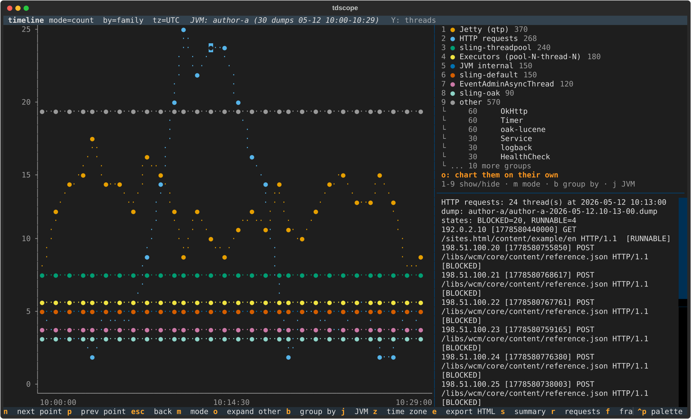
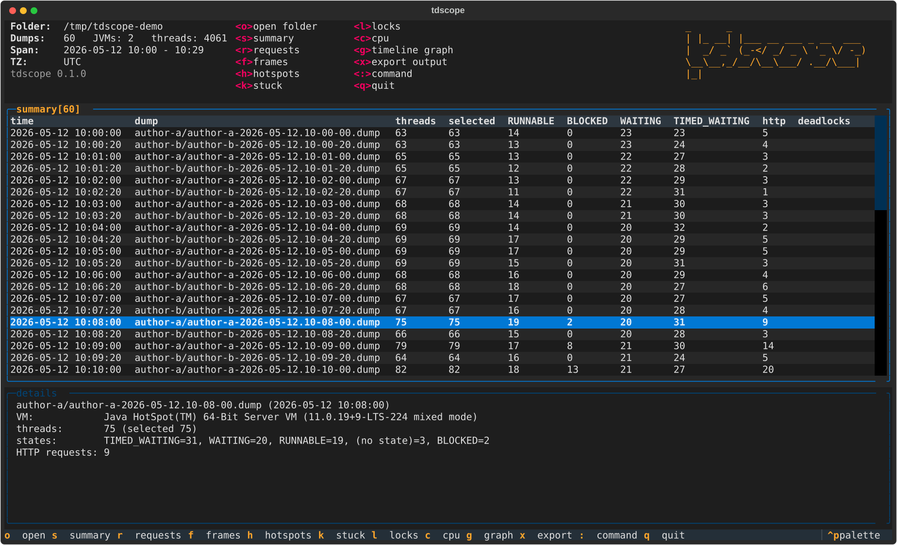
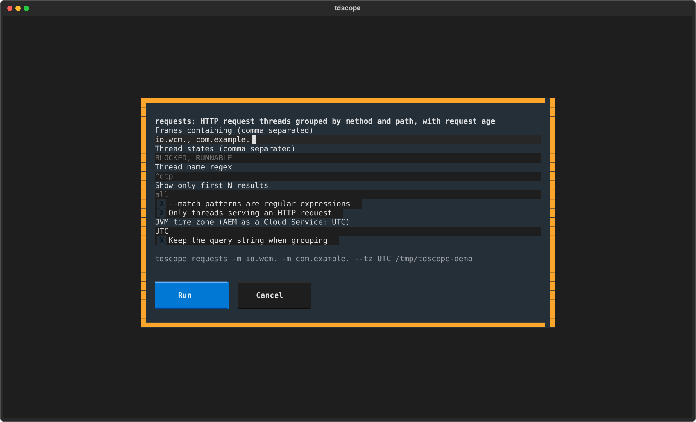
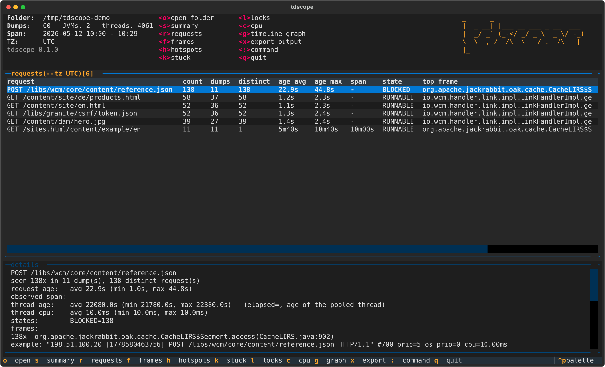
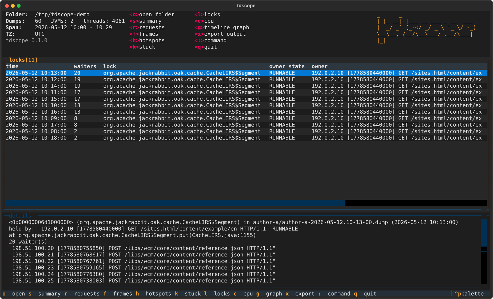
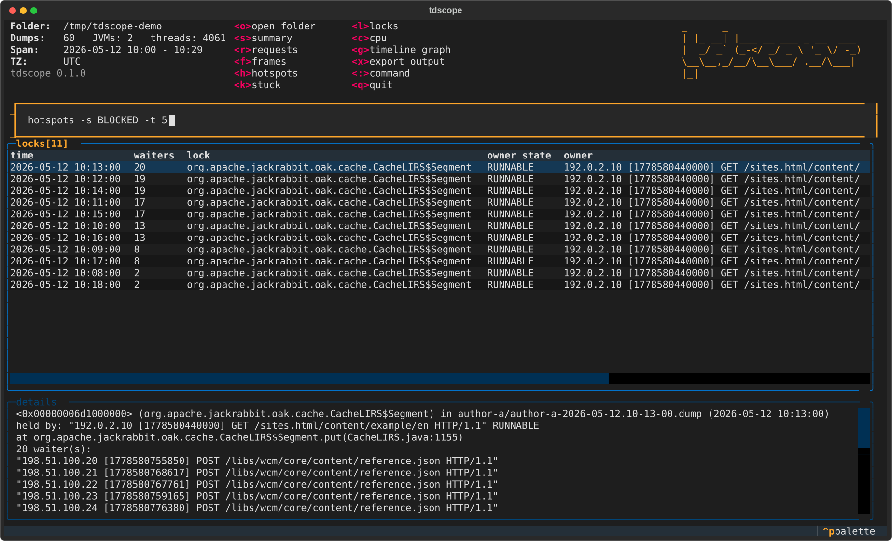
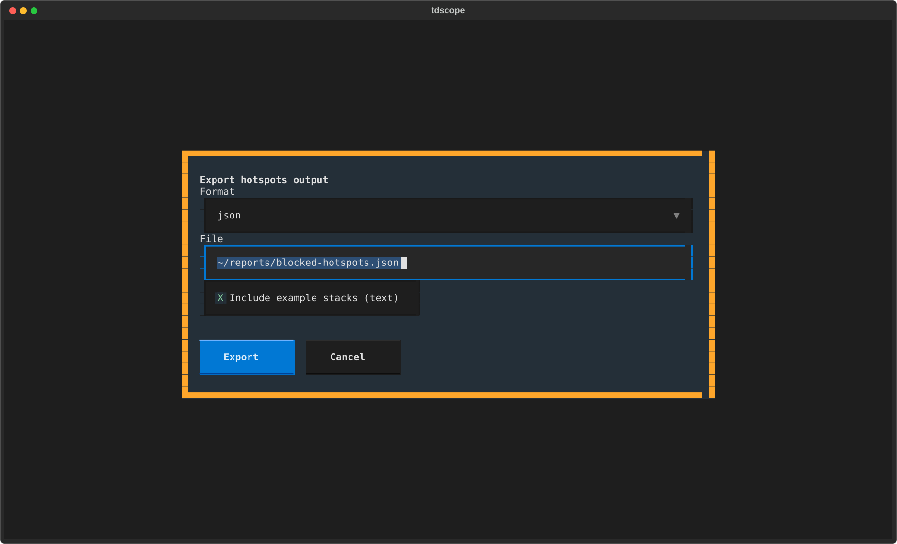
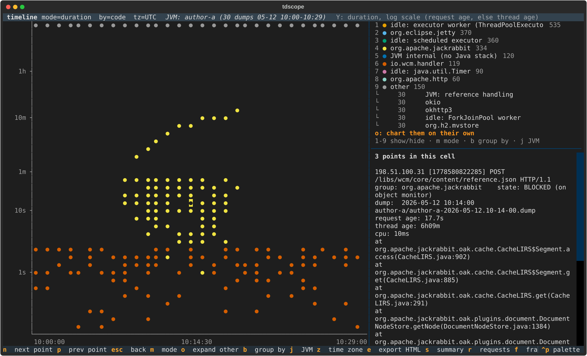
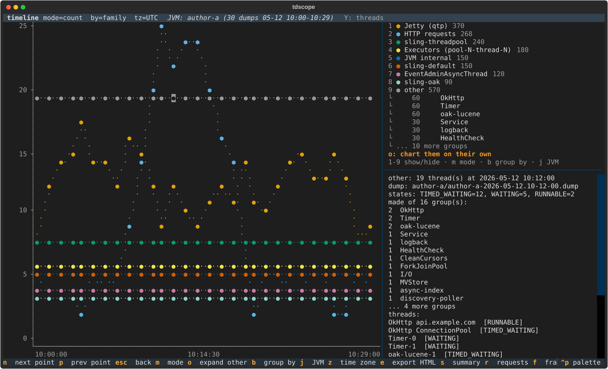
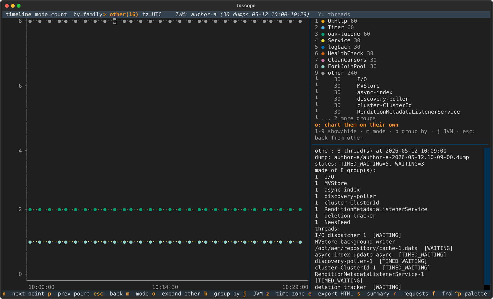

# tdscope TUI

An interactive, [k9s](https://k9scli.io/)-style terminal UI for the tdscope analyses,
with a timeline graph of threads over time.



- [Install and start](#install-and-start)
- [The main view](#the-main-view)
- [Running analyses](#running-analyses)
- [Command line](#command-line)
- [Exporting results](#exporting-results)
- [Timeline graph](#timeline-graph)
- [Identifying the "other" group](#identifying-the-other-group)
- [Keys](#keys)
- [Tips](#tips)

All screenshots use a synthetic demo data set (see below), not real dumps.

## Install and start

```bash
pip install 'tdscope[tui]'
tdscope tui path/to/dumps            # a folder (scanned recursively) or a single file
tdscope tui path/to/dumps --tz UTC   # time zone of the JVM, e.g. for AEM as a Cloud Service
tdscope tui                          # start empty and open a folder with <o>
```

No dumps at hand? Generate the demo set used for the screenshots:

```bash
python docs/demo/make_demo_dumps.py demo-dumps
tdscope tui demo-dumps --tz UTC
```

It contains two AEM-like author JVMs with 30 dumps each. Between 10:08 and 10:18 a
long request on `author-a` holds an Oak cache segment and `reference.json` requests pile
up behind it.

## The main view



| Area | Content |
|------|---------|
| top left | opened folder, number of dumps, JVM processes and threads, time span, time zone |
| top middle | keyboard shortcuts |
| table | result of the last analysis, one row per item; the title shows the analysis, its options and the row count |
| details | full text report of the selected row, including an example stack trace |
| footer | keys available on the current screen |

Opening a folder runs `summary` straight away: one row per dump with thread states,
HTTP requests and JVM-detected deadlocks.

## Running analyses

Each analysis has its own key. The key opens a form with the analysis options. The
bottom of the form shows the equivalent CLI command, so you can copy it into a script.

| Key | Analysis | What it shows |
|-----|----------|---------------|
| `s` | summary | per-dump thread counts, states, HTTP requests, deadlocks |
| `r` | requests | HTTP request threads grouped by method and path: count, request age, observed span, top frame |
| `f` | frames | unique frames matching *Frames containing*, e.g. your own packages |
| `h` | hotspots | threads grouped by identical stacks |
| `k` | stuck | threads with an unchanged stack across consecutive dumps |
| `l` | locks | contended locks with their owner and waiters, deadlocks |
| `c` | cpu | CPU burned per thread between consecutive dumps |



Common fields:

- **Frames containing**: comma-separated substrings (or regular expressions with the
  checkbox below). Only threads with a matching frame are kept, e.g. `io.wcm., com.mycompany.`.
- **Thread states**: e.g. `BLOCKED, RUNNABLE`.
- **Thread name regex**: e.g. `^qtp` for Jetty threads.
- **Show only first N results**: an empty field shows all results.

`Enter` in any field (or the **Run** button) runs the analysis, and `Esc` cancels. Each
form remembers what you typed last time. Invalid input, such as `frames` without a
pattern or a bad regex, is reported inside the form.

Move through the results with `↑` `↓`. The details panel follows the selected row:





## Command line

`:` opens a command line, as in k9s. It takes the same arguments as the CLI, minus the
path:



| Command | Effect |
|---------|--------|
| `:requests -m io.wcm. --tz UTC` | any analysis with CLI options (`summary`, `requests`, `frames`, `hotspots`, `stuck`, `locks`, `cpu`) |
| `:hotspots -s BLOCKED -t 5` | top 5 stacks of blocked threads |
| `:open ~/dumps/incident-42` | open another folder |
| `:export ~/reports/locks.json` | export the current result; `.json` writes JSON, anything else plain text |
| `:graph` | open the timeline graph |
| `:q` | quit |

`Esc` closes the command line without running anything.

## Exporting results

`x` saves the result currently in the table to a file:



- **text**: the same report the CLI prints, optionally with example stacks;
- **json**: the same JSON as `tdscope <analysis> -f json`, for scripts or other tools.

The format follows the file extension as you type (`.json`, `.txt`). Missing folders are
created.

> Exports contain thread names, URLs and stack traces from your dumps. The default file
> names (`tdscope-*.txt|json|html`) are git-ignored in this repository; take the same
> care elsewhere.

## Timeline graph

`g` opens the graph. Dump time runs along the X axis. Every thread group gets a color
and an entry in the legend. Use `m` to switch the Y axis between two modes.

**count**: number of threads in each group, per dump. Hover a point to see what the
group consisted of at that moment:


**duration**: one point per thread per dump, on a log scale. The Y value is the request
age if the request start is known (Sling/AEM put it in the thread name), otherwise the
thread age (`elapsed=`). Long-running requests show up as rising diagonals, and blocked
requests as a column of points:



The panel on the right shows the hovered point: thread name, group, state, dump,
duration, CPU and top frames. If several threads fall into one terminal cell, it lists
them all.

### Grouping (`b`)

| Grouping | Groups threads by | Example groups |
|----------|-------------------|----------------|
| `pool` | thread pool name with counters and ids normalized | `qtpN-N`, `sling-threadpool-*-(apache-sling-job-thread-pool)-N` |
| `family` | coarse name family | `Jetty (qtp)`, `JVM internal`, `sling-oak`, `OkHttp`, `Executors (pool-N-thread-N)` |
| `code` | what the thread executes: package of its top-most non-JDK frame | `org.apache.jackrabbit`, `org.eclipse.jetty`, `io.wcm.handler`, `idle: executor worker (ThreadPoolExecutor)` |
| `state` | `java.lang.Thread.State` | `RUNNABLE`, `BLOCKED`, `TIMED_WAITING` |
| `request` | HTTP method and path (request threads only) | `POST /libs/wcm/core/content/reference.json` |

`code` is often the most telling. Threads whose stack holds only JDK frames are named
after their characteristic frame, for example `idle: executor worker`,
`idle: scheduled executor`, `idle: java.util.Timer` or `JVM: reference handling`.

### JVMs and time zones

- `j` switches between JVM processes. tdscope recognizes the JVM by the native address
  of start-up threads, so dumps of several nodes, or of a node before and after a
  restart, are never mixed. The last entry shows all JVMs together.
- Dump timestamps are local JVM time without a zone. If request ages come out negative
  in your local zone but not in UTC, the graph switches to UTC by itself and says so.
  `z` cycles the zone manually. With `--tz` on the command line, that zone is used.

### HTML export

`e` saves the current graph as a self-contained HTML page with an SVG chart, light and
dark theme, hover tooltips, a clickable legend and the list of groups inside "other".
Points that overlap are merged into one marker, so even 60 000 threads stay at a couple
of megabytes.

## Identifying the "other" group

Nine groups get their own color. Everything else is merged into **other** (gray). To see
what is inside it:

1. **Legend**: under `other` the largest merged groups are listed with their thread totals.
2. **Hover** an "other" point in count mode: the panel shows which groups made up that
   point at that moment.

   

3. **Press `o`**: the graph shows only the groups that were in "other", each with its own
   color. Press `o` again to go one level deeper, and `Esc` to go back. The title shows
   where you are, e.g. `by=family > other(16)`.

   

4. **Switch grouping** with `b`: `family` and especially `code` usually leave far fewer
   threads in "other" than `pool`.

## Keys

Main view

| Key | Action |
|-----|--------|
| `o` | open a folder or file |
| `s` `r` `f` `h` `k` `l` `c` | run an analysis (opens its form) |
| `↑` `↓` `PgUp` `PgDn` | move through results |
| `:` | command line |
| `x` | export the current result |
| `g` | timeline graph |
| `q` | quit |

Timeline graph

| Key | Action |
|-----|--------|
| mouse hover / click | show details of the point under the cursor |
| `←` `→` `↑` `↓` (`Shift` = faster) | move the cursor |
| `n` / `p` | jump to the next / previous point |
| `m` | count / duration mode |
| `b` | grouping: pool, family, code, state, request |
| `j` | JVM |
| `z` | time zone |
| `1`-`9` | hide / show a group |
| `o` | expand "other" into its own chart |
| `e` | export as HTML |
| `Esc` | back from "other", then back to the main view |

## Tips

- **Mouse in tmux/screen**: hovering needs mouse reporting. Enable it with
  `set -g mouse on` in tmux. Without a mouse, use the arrow keys and `n`/`p`.
- **Big data sets**: loading 100+ dumps takes a few seconds and the UI shows a loading
  indicator. Analyses run in the background, so the UI stays responsive.
- **Same results as the CLI**: the TUI calls exactly the same analysis code as
  `tdscope <analysis>`, and each form shows the matching command line.

### Regenerating the screenshots

```bash
pip install -e ".[dev,tui]"
python docs/make_screenshots.py
```

The script generates the demo dumps in a temporary folder, drives the TUI headlessly and
writes the SVG files to `docs/screenshots/`.
